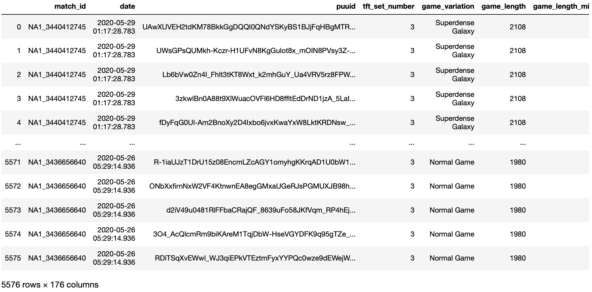
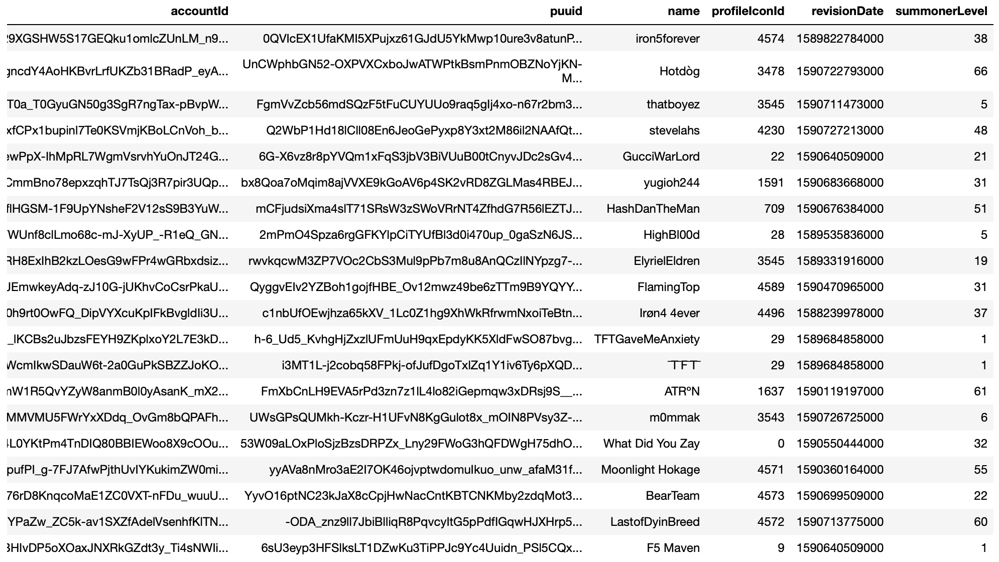

# TFT Dataset

## The following dataset contains all tft match history information

### Q: How was the data gathered and how is it organized?
1. Given a set of players, pulled the past 200 tft matches for each player respectively
2. Aggreated the list of matches and removed all duplicates
3. For each match, pulled the rank respective rank information
4. Since each match has 8 players, performed the following for each player meaning each match represents 8 rows:
    1. Pulled all the endgame match stats such as damage dealt to players, ending gold, level, ect.
    2. Parsed all units, items on each unit, number of the units, total number of units, ect.  
    3. Parsed all traits, number of units for each trait, trait bonus, ect.
    
The following matches were from 20 players, all matches are unique and there is no overlapping information

# Summoner Dataset

## The following dataset contains all summoners' information

Note: This readme will be updated once the dataset is complete. I am currently waiting for Riot's approval for rate limit increase to their API to finish this dataset.
